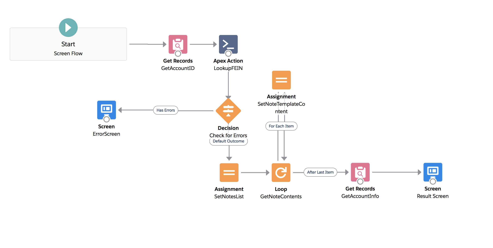

# DataMerch-Integration
For use with [DataMerch](https://www.datamerch.com/), in Salesforce.
DataMerch allows Funders to quickly find/share information regarding Merchant financial standing via FEIN.

To setup, create a named credential for the API endpoint and add the url to Remote Site Settings.
Then create a Flow that utilizes the APEX class and can parse the results as needed. An exmaple flow is pictured below

